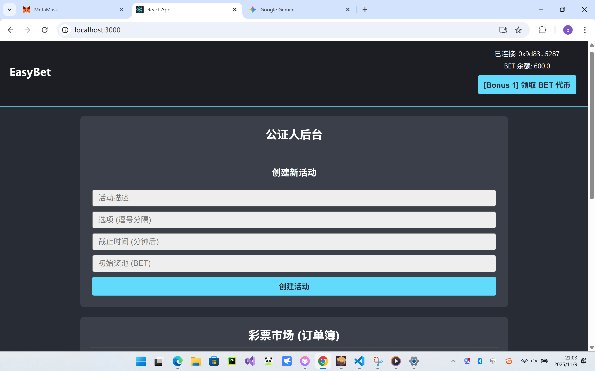
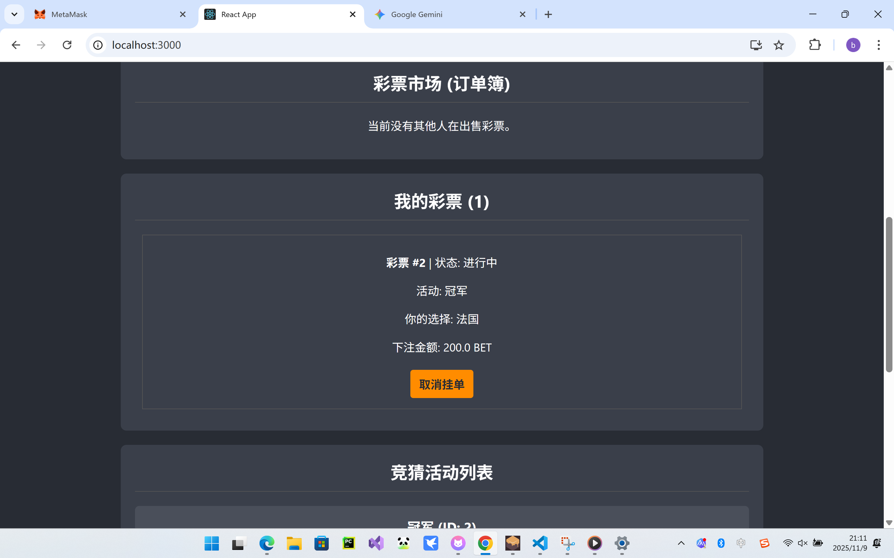
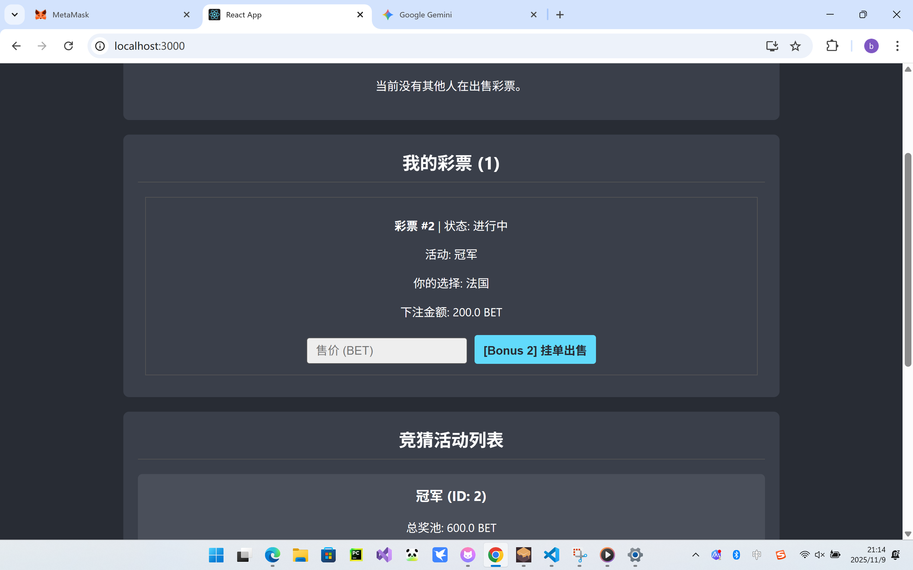
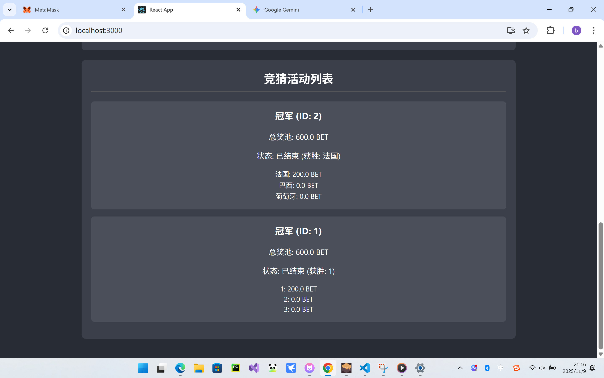

# EasyBet 去中心化彩票系统

本项目是一个基于 Solidity 和 React 的去中心化应用。它允许“公证人”创建竞猜活动，用户使用 ERC20 代币 (`BetToken`) 进行下注，并获得一个 ERC721 NFT (`BetTicket`) 作为凭证。

核心逻辑在 `EasyBet.sol` 合约中，它负责管理活动、奖池以及一个二级市场。

## 核心功能

1.  **公证人创建竞猜**
    * **功能**：只有合约的部署者（公证人）才能创建新的竞猜活动。
    * **实现**：`EasyBet` 合约中的 `createActivity` 函数受到了 `onlyNotary` 修饰符的保护。前端 `NotaryAdmin` 组件 会在账户匹配时显示此管理面板。

2.  **用户下注与 NFT 凭证**
    * **功能**：用户可以选择一个未结算的活动，使用 `BetToken` 对特定选项下注，并收到一张 NFT 彩票。
    * **实现**：`EasyBet` 合约的 `placeBet` 函数会接收用户的 `BetToken`，然后调用 `BetTicket` 合约的 `mintTicket` 函数，为用户铸造一张NFT。这张 NFT 通过 `ticketInfo` 映射 记录了活动ID、选项和下注金额。

3.  **活动结算与奖金分配**
    * **功能**：公证人宣布获胜选项后，持有获胜 NFT 的用户可以领取奖金。
    * **实现**：公证人调用 `resolveActivity` 来锁定获胜选项。获胜者调用 `claimWinnings`，合约会根据该 NFT 的下注金额占总获胜池的比例来计算奖金，并发放 `BetToken`。领奖后，该 NFT 凭证会被销毁。

## Bonus 功能

### Bonus 1: ERC20 测试代币

* **功能**：允许任何用户免费获取一定数量的 `BetToken` 用于测试。
* **实现**：`BetToken.sol` 合约中实现了一个 `faucet` 函数，调用时会为 `msg.sender` 铸造（mint）1000 个代币。前端 `WalletInfo` 组件 提供了一个按钮来触发此功能。

### Bonus 2: NFT 彩票二级市场

* **功能**：允许用户在活动结算前自由买卖他们持有的 `BetTicket` NFT。
* **实现**：
    1.  **挂单/取消挂单**：`listTicket` 和 `unlistTicket` 函数允许 NFT 持有者（在 `approve` 授权后）将其彩票上架或下架。
    2.  **购买彩票**：`buyTicket` 函数实现了原子化交易：它首先将买家的 `BetToken` 转给卖家，然后将卖家的 `BetTicket` NFT 转给买家。
    3.  **订单簿管理**：为了让前端能够高效遍历所有挂单，`EasyBet.sol` 使用了一个数组 `_listedTokenIds` 和一个映射 `_listedTokenIndex`。在移除订单时，`_removeListedToken` 函数将数组的最后一个元素移到被删除元素的位置并更新其索引，从而维护订单簿。
    4.  **前端展示**：前端的 `refreshAll` 函数会获取 `_listedTokenIds` 列表，然后并发获取每张彩票的价格 (`sellOrders`) 和详细信息 (`ticketInfo`)，最终在 `OrderBook` 组件中向买家完整展示活动、选项和价格。

## 运行截图

运行成功后看到初始页面，点击连接到metamask会自动连接到metamask的活动账户，这里先选择“公证人”账户




为方便测试，每个账户都可以无限制领取BET代币，比如这里点击领取按钮


公证人可以创建活动


活动创建后，每个账户都可以下注，下注之后可以在我的彩票中看到


可以将拥有的彩票以指定价格挂出，也可以取消挂单


挂出的彩票会出现在其他账户的彩票市场，按照价格排序


购买之后就会进入我的彩票



公证人可以手动结算活动



切换到持有彩票的那个账户可以领取奖励


## 如何运行

补充如何完整运行你的应用。

1. 在本地启动ganache应用。

2. 在 `./contracts` 中安装需要的依赖，运行如下的命令：
    ```bash
    npm install
    ```
3. 在 `./contracts` 中编译合约，运行如下的命令：
    ```bash
    npx hardhat compile
    ```
4. 部署命令：
    ```bash
    npx hardhat run scripts/deploy.ts --network ganache
    ```
    这步会输出三个地址，需要分别写入`./frontend/src/ethers.ts`开头的三个变量处
5. 将编译新生成的typechain-types复制到`./frontend/src/`
6. 在 `./frontend` 中安装需要的依赖，运行如下的命令：
    ```bash
    npm install
    ```
7. 在 `./frontend` 中启动前端程序，运行如下的命令：
    ```bash
    npm start
    ```
